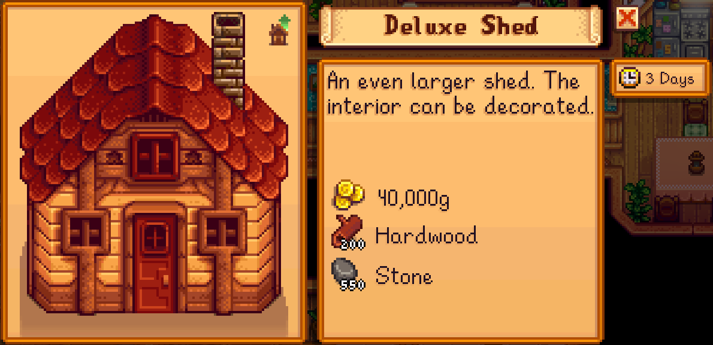
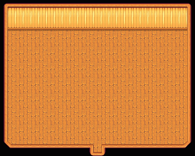
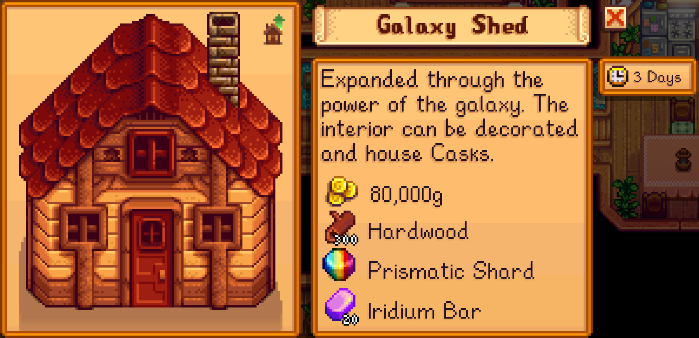
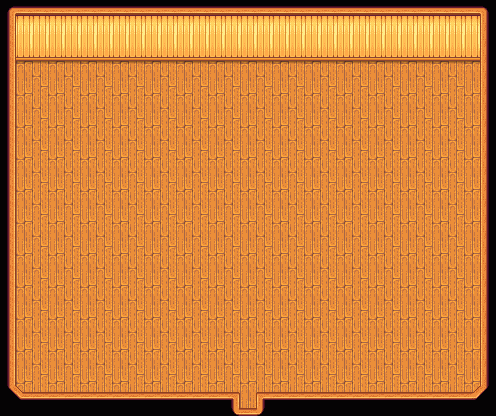
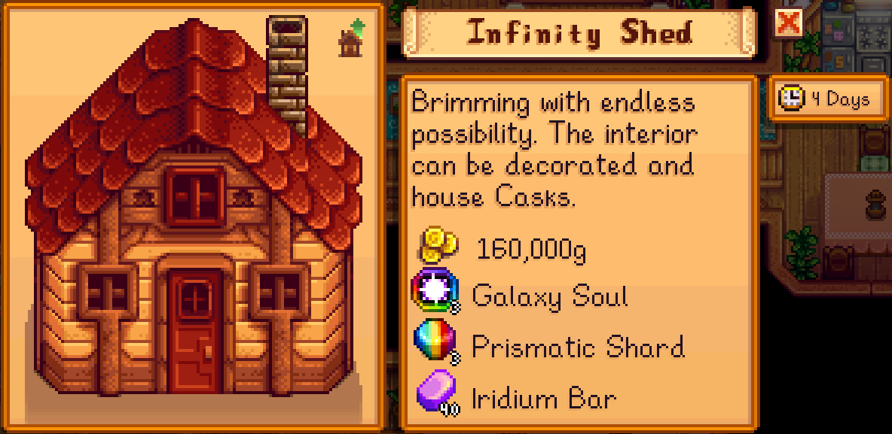
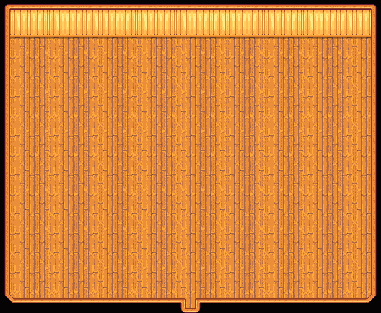
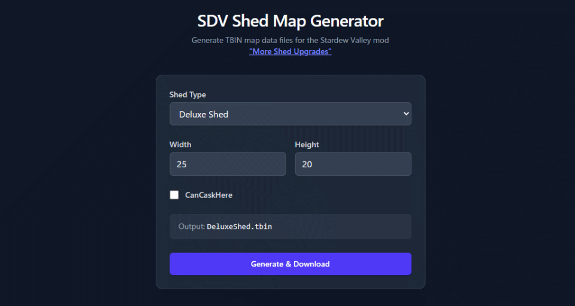

# More Shed Upgrades - Stardew Valley Mod

| English | [日本語](./doc/README-jp.md) |

**Overview**

Adds three upgrade tiers beyond the vanilla Big Shed: Deluxe Shed, Galaxy Shed, and Infinity Shed. Each tier expands the interior space, and later tiers allow placing Casks. All costs, build time, and required materials are fully configurable.

**Distribution**

- [Nexus Mods](https://www.nexusmods.com/stardewvalley/mods/37776)

**Notice**

This is an unofficial mod developed by an individual (adhi sang / adhi-jp). It’s not affiliated with or endorsed by the official developers or publishers of Stardew Valley. Please do not contact the official parties for support regarding this mod.

## Features

- Upgrades are requested from Robin, just like vanilla.

- Each shed tier only appears in Robin’s menu if you already have the previous tier built.

- Upgrade details

  - Deluxe Shed

    | Field              | Data                           |
    | ------------------ | ------------------------------ |
    | Interior size      | 25 x 20 tiles                  |
    | Build cost         | 40,000 g                       |
    | Required materials | Hardwood x200 <br/> Stone x550 |
    | Build time         | 3 days                         |
    | Notes              | Furniture can be placed        |

    Building data  
    [](./doc/deluxe-building-data.png)

    Interior preview  
    

  - Galaxy Shed

    | Field              | Data                                                         |
    | ------------------ | ------------------------------------------------------------ |
    | Interior size      | 31 x 26 tiles                                                |
    | Build cost         | 80,000 g                                                     |
    | Required materials | Hardwood x300 <br/> Prismatic Shard x1 <br/> Iridium Bar x20 |
    | Build time         | 4 days                                                       |
    | Notes              | Furniture and Casks can be placed                            |

    Building data  
    [](./doc/galaxy-building-data.png)

    Interior preview  
    

  - Infinity Shed

    | Field              | Data                                                          |
    | ------------------ | ------------------------------------------------------------- |
    | Interior size      | 39 x 32 tiles                                                 |
    | Build cost         | 160,000 g                                                     |
    | Required materials | Galaxy Soul x3 <br/> Prismatic Shard x3 <br/> Iridium Bar x40 |
    | Build time         | 4 days                                                        |
    | Notes              | Furniture and Casks can be placed                             |

    Building data  
    [](./doc/infinity-building-data.png)

    Interior preview  
    

- Costs, build time, and required materials are configurable. See Configuration below.

## Requirements

- Stardew Valley 1.6+

- [SMAPI]

- [Content Patcher]

## Installation

1. Install [SMAPI] and [Content Patcher] if you haven’t already.

2. Extract this mod into your Stardew Valley `Mods` folder.

   Final folder structure should look like:

   ```text
   📁 Stardew Valley
    └╴📁 Mods
       ├╴📁 [CP] More Shed Upgrades
       │  ├╴📁 assets
       │  ├╴📁 data
       │  ├╴📁 i18n
       │  ├╴📄 content.json
       │  └╴📄 manifest.json
       ├╴📁 ContentPatcher
       └╴📁 ... other mods ...
   ```

3. Launch the game via SMAPI.

> [!TIP]
> For how to install mods or locate the `Mods` folder, see the wiki’s [Mod Install Guide].

## Configuration

On first launch, a `config.json` is generated in the mod folder. For each shed tier you can change build days, build cost, and up to three required materials. If you use [Generic Mod Config Menu], you can edit these in-game.

> [!NOTE]
> Materials use the Qualified Item ID format, e.g., `(O)709`. See:
>
> - Item ID format: https://wiki.stardewvalley.net/Modding:Common_data_field_types#Item_ID
> - Object sprite list: https://wiki.stardewvalley.net/Modding:Objects/Object_sprites

## Localization

Built-in languages and translation status:

| Language | Status |
| -------- | ------ |
| English  | 100%   |
| Japanese | 100%   |

## Using Custom Textures

You can customize the shed textures by placing per-shed textures in this mod’s `assets/Buildings` folder. If no custom textures are provided, the sheds will use the vanilla Big Shed sprites.

Texture filenames and their purpose:

| Filename                     | Purpose                                                            |
| ---------------------------- | ------------------------------------------------------------------ |
| `DeluxeShed.png`             | Exterior texture for Deluxe Shed                                   |
| `DeluxeShed_PaintMask.png`   | Paint mask defining paintable regions for Deluxe Shed (optional)   |
| `GalaxyShed.png`             | Exterior texture for Galaxy Shed                                   |
| `GalaxyShed_PaintMask.png`   | Paint mask defining paintable regions for Galaxy Shed (optional)   |
| `InfinityShed.png`           | Exterior texture for Infinity Shed                                 |
| `InfinityShed_PaintMask.png` | Paint mask defining paintable regions for Infinity Shed (optional) |

> [!NOTE]
> Paint mask files are optional. Include them only if you want to enable the building painting feature for these sheds.

Example placement:

```text
📁 Stardew Valley
 └╴📁 Mods
  ├╴📁 [CP] More Shed Upgrades
  │  ├╴📁 assets
  │  │  └╴📁 Buildings
  │  │     ├╴🖼️ DeluxeShed.png
  │  │     ├╴🖼️ DeluxeShed_PaintMask.png
  │  │     ├╴🖼️ GalaxyShed.png
  │  │     ├╴🖼️ GalaxyShed_PaintMask.png
  │  │     ├╴🖼️ InfinityShed.png
  │  │     └╴🖼️ InfinityShed_PaintMask.png
  │  └╴📄 ... other files and folders ...
  └╴📁 ... other mods ...
```

Quick steps to apply custom textures:

1. Open `Mods/[CP] More Shed Upgrades/assets/Buildings`.
2. Add the texture files matching each shed name (e.g., `DeluxeShed.png`, `GalaxyShed.png`, `InfinityShed.png`).
3. Optional: add the paint mask files (e.g., `DeluxeShed_PaintMask.png`) to enable painting support.

## Customizing Shed Interior Size

You can change each shed's interior size to any dimensions you like by replacing the `.tbin` map data files bundled with this mod.

A dedicated web app is available for generating custom `.tbin` files:

**[SDV Shed Map Generator]**

[][SDV Shed Map Generator]

Default interior sizes for reference:

| Shed Type     | Default Width | Default Height | CanCaskHere |
| ------------- | ------------- | -------------- | ----------- |
| Deluxe Shed   | 25            | 20             | No          |
| Galaxy Shed   | 31            | 26             | Yes         |
| Infinity Shed | 39            | 32             | Yes         |

Steps:

1. Open the [SDV Shed Map Generator].
2. Select the **Shed Type** you want to customize (Deluxe Shed / Galaxy Shed / Infinity Shed).
3. Enter the desired **Width** and **Height**.
4. Check **CanCaskHere** if you want Casks to be placeable inside the shed.
5. Click **Generate & Download** to download the `.tbin` file.
6. Copy the downloaded `.tbin` file into `[CP] More Shed Upgrades/assets/Maps/`, replacing the existing file.
7. Relaunch the game.

File placement:

```text
📁 Stardew Valley
 └╴📁 Mods
    ├╴📁 [CP] More Shed Upgrades
    │  ├╴📁 assets
    │  │  ├╴📁 Buildings
    │  │  └╴📁 Maps
    │  │     ├╴📄 DeluxeShed.tbin
    │  │     ├╴📄 GalaxyShed.tbin
    │  │     └╴📄 InfinityShed.tbin
    │  └╴📄 ... other files and folders ...
    └╴📁 ... other mods ...
```

> [!WARNING]
> Custom `.tbin` files in the `assets/Maps/` folder will be overwritten when the mod is updated. After updating, you will need to re-generate and replace any customized map files.

## Limitations with AlternativeTextures

- The sheds added by this mod are not targeted by [AlternativeTextures].
- When you don’t provide custom textures, these sheds fall back to the vanilla Big Shed sprites; however, any textures swapped for the vanilla Big Shed via AlternativeTextures will not apply to these sheds.
- Reason: AlternativeTextures changes textures on a per-building basis, and the sheds added by this mod have different internal building IDs from the vanilla Big Shed.
- At this time, compatibility with AlternativeTextures is not supported.

## License

More Shed Upgrades is developed and released under the [MIT](./LICENSE) license.

<!-- Link definitions -->

[SMAPI]: https://www.nexusmods.com/stardewvalley/mods/2400
[Content Patcher]: https://www.nexusmods.com/stardewvalley/mods/1915
[Mod Install Guide]: https://www.stardewvalleywiki.com/Modding:Player_Guide/Getting_Started#Install_mods
[Generic Mod Config Menu]: https://www.nexusmods.com/stardewvalley/mods/5098
[AlternativeTextures]: https://www.nexusmods.com/stardewvalley/mods/9246
[SDV Shed Map Generator]: https://sdv-shed-mapdata-generator.netlify.app/
