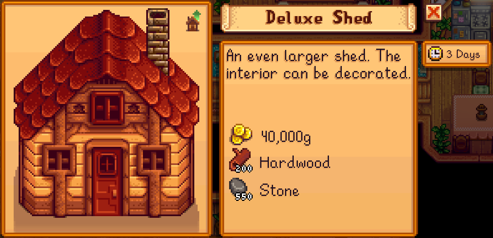
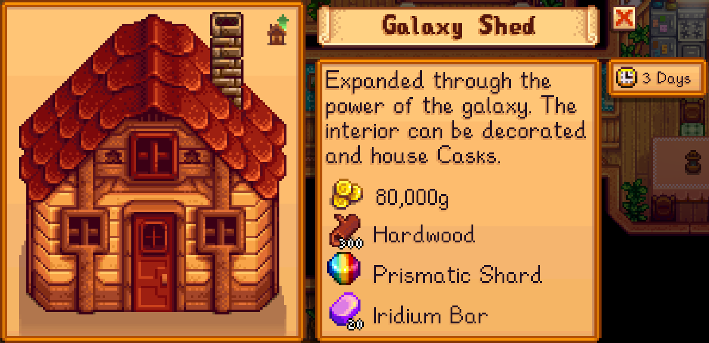
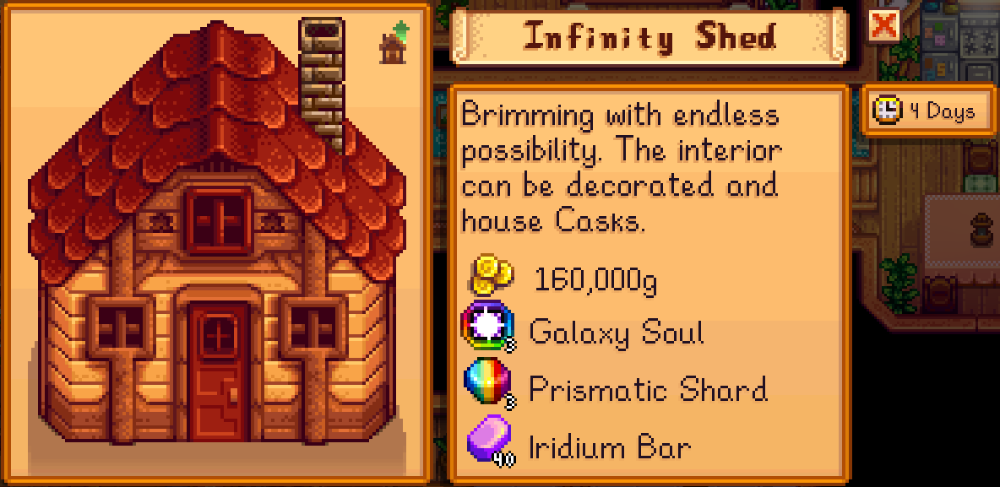

# More Shed Upgrades - Stardew Valley Mod

| [English](../README.md) | 日本語 |

---

【概要】

バニラの「ビッグシェッド」に、3 段階のアップグレード（デラックスシェッド／ギャラクシーシェッド／インフィニティシェッド）を追加します。
各段階で建物の内部スペースが拡張され、後半の段階では「熟成ダル」を設置できるようになります。
建築に必要な費用・日数・素材は、コンフィグで自由に変更できます。

【配布サイト】

- [Nexus Mods](https://www.nexusmods.com/stardewvalley/mods/37776)

【注意事項】

本 Mod は、adhi sang（adhi-jp）が個人で開発した非公式の Mod です。  
Stardew Valley の公式（開発元・販売元）とは一切関係ありません。  
本 Mod に関するお問い合わせを公式へ行うことは先方のご迷惑となりますので、ご遠慮ください。

## 機能

- アップグレードは、バニラと同様にロビンへ依頼できます。

- 各シェッドは、前段階のシェッドがすでに建築済みの場合にのみ、建築メニューに表示されます。

- アップグレードの詳細

  - デラックスシェッド

    | 項目             | データ                      |
    | ---------------- | --------------------------- |
    | 建物内部の大きさ | 25 × 20 マス                |
    | 建築費用         | 40,000 g                    |
    | 建築に必要な素材 | 堅い木 × 200 <br/> 石 × 550 |
    | 建築日数         | 3 日                        |
    | 備考             | 家具を設置可能              |

    【建築データ】  
    [](./deluxe-building-data.png)

    【マップデータ】  
    

  - ギャラクシーシェッド

    | 項目             | データ                                                                |
    | ---------------- | --------------------------------------------------------------------- |
    | 建物内部の大きさ | 31 × 26 マス                                                          |
    | 建築費用         | 80,000 g                                                              |
    | 建築に必要な素材 | 堅い木 × 300 <br/> レインボージェム × 1 <br/> イリジウムののべ棒 × 20 |
    | 建築日数         | 4 日                                                                  |
    | 備考             | 家具に加えて、熟成ダルを設置可能                                      |

    【建築データ】  
    [](./galaxy-building-data.png)

    【マップデータ】  
    

  - インフィニティシェッド

    | 項目             | データ                                                                          |
    | ---------------- | ------------------------------------------------------------------------------- |
    | 建物内部の大きさ | 39 × 32 マス                                                                    |
    | 建築費用         | 160,000 g                                                                       |
    | 建築に必要な素材 | ギャラクシーソウル × 3 <br/> レインボージェム × 3 <br/> イリジウムののべ棒 × 40 |
    | 建築日数         | 4 日                                                                            |
    | 備考             | 家具に加えて、熟成ダルを設置可能                                                |

    【建築データ】  
    [](./infinity-building-data.png)

    【マップデータ】  
    

- 建築費用・建設日数・必要素材は設定で変更できます。詳細は「[コンフィグ](#コンフィグ)」をご覧ください。

## この Mod の動作に必要な環境

- Stardew Valley 1.6 以降

- [SMAPI]

- [Content Patcher]

## インストール方法

1. [SMAPI] と [Content Patcher] が未導入の場合は、先に導入してください。

2. ダウンロードした Mod の zip ファイルを、Stardew Valley の `Mods` フォルダに展開します。

   最終的なフォルダ構成は次のとおりです。

   ```text
   📁 Stardew Valley
   └╴📁 Mods
       ├╴📁 [CP] More Shed Upgrades
       │  ├╴📁 assets
       │  ├╴📁 data
       │  ├╴📁 i18n
       │  ├╴📄 content.json
       │  └╴📄 manifest.json
       ├╴📁 ContentPatcher
       └╴📁 ... その他の Mod ...
   ```

3. SMAPI 経由でゲームを起動します。

> [!TIP]
> `Mods` フォルダの場所は、Wiki の「[Mod インストールガイド][Mod Install Guide]」を参照してください。

## コンフィグ

初回起動時、Mod のフォルダに `config.json` が生成されます。
各シェッドごとに、建設日数・建設費用・必要素材（最大 3 種類）を変更できます。
[Generic Mod Config Menu] を導入している場合は、ゲーム内から設定を変更できます。

> [!NOTE]
> 必要素材は `(O)709` のような「Qualified Item ID」形式で記述します。詳細は以下を参照してください。
>
> - アイテム ID の形式： https://wiki.stardewvalley.net/Modding:Common_data_field_types#Item_ID
> - アイテム ID 一覧： https://wiki.stardewvalley.net/Modding:Objects/Object_sprites

## ローカライズ

More Shed Upgrades がビルトインで対応している言語と翻訳状況は以下のとおりです。

| 言語     | 翻訳状況 |
| -------- | -------- |
| English  | 100 %    |
| Japanese | 100 %    |

## カスタムテクスチャを使用する

この Mod の `assets/Buildings` フォルダに各シェッド用のテクスチャを配置することで、シェッドのテクスチャをカスタマイズできます。  
カスタムテクスチャが配置されていない場合は、バニラの「ビッグシェッド」のテクスチャが使用されます。

【シェッドごとのテクスチャファイル名と用途説明】

| ファイル名                 | 用途                                                              |
| -------------------------- | ----------------------------------------------------------------- |
| DeluxeShed.png             | デラックスシェッドの外観テクスチャ                                |
| DeluxeShed_PaintMask.png   | デラックスシェッドのペイント領域を設定するマスクファイル（※）     |
| GalaxyShed.png             | ギャラクシーシェッドの外観テクスチャ                              |
| GalaxyShed_PaintMask.png   | ギャラクシーシェッドのペイント領域を設定するマスクファイル（※）   |
| InfinityShed.png           | インフィニティシェッドの外観テクスチャ                            |
| InfinityShed_PaintMask.png | インフィニティシェッドのペイント領域を設定するマスクファイル（※） |

> [!NOTE]
> ※ マスクファイルは存在しなくても問題ありません。建物のペイント機能に対応させたい場合は用意してください。

【テクスチャの配置例】

```
📁 Stardew Valley
 └╴📁 Mods
    ├╴📁 [CP] More Shed Upgrades
    │  ├╴📁 assets
    │  │  └╴📁 Buildings
    │  │     ├╴🖼️ DeluxeShed.png
    │  │     ├╴🖼️ DeluxeShed_PaintMask.png
    │  │     ├╴🖼️ GalaxyShed.png
    │  │     ├╴🖼️ GalaxyShed_PaintMask.png
    │  │     ├╴🖼️ InfinityShed.png
    │  │     └╴🖼️ InfinityShed_PaintMask.png
    │  └╴📄 ... その他のファイルやフォルダ ...
    └╴📁 ... その他の Mod ...
```

【カスタムテクスチャの適用手順まとめ】

1. `Mods/[CP] More Shed Upgrades/assets/Buildings` フォルダを開く

2. 各シェッド名に対応するテクスチャファイルを配置する

   例：`DeluxeShed.png`、`GalaxyShed.png` など

3. （任意）ペイント機能に対応させたい場合はマスクファイルを配置する

   例：`DeluxeShed_PaintMask.png`、`GalaxyShed_PaintMask.png` など

## AlternativeTextures と併用する場合の制限について

この Mod で追加されるシェッドは [AlternativeTextures] によるテクスチャ変更の対象にはなりません。

カスタムテクスチャを使用しない場合、追加シェッドはバニラの「ビッグシェッド」のテクスチャを参照します。  
しかし、[AlternativeTextures] の機能で「ビッグシェッド」のテクスチャを変更していても、この Mod のシェッドには反映されません。

これは、[AlternativeTextures] が「建物単位」でテクスチャを変更していることによるものです。  
バニラの「ビッグシェッド」と、この Mod で追加されるシェッドでは「内部的な建物 ID」が異なるため、変更対象になりません。

現時点では [AlternativeTextures] との互換性を確保することはできません。

## ライセンス

More Shed Upgrades は [MIT](../LICENSE) ライセンスの下で開発・公開されています。

<!-- リンク定義 -->

[SMAPI]: https://www.nexusmods.com/stardewvalley/mods/2400
[Content Patcher]: https://www.nexusmods.com/stardewvalley/mods/1915
[Mod Install Guide]: https://www.stardewvalleywiki.com/Modding:Player_Guide/Getting_Started#Install_mods
[Generic Mod Config Menu]: https://www.nexusmods.com/stardewvalley/mods/5098
[AlternativeTextures]: https://www.nexusmods.com/stardewvalley/mods/9246
